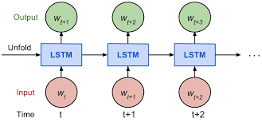

# Text-Generation-using-LSTM

Description:
- My first project in NLP domain
- I implemented this with the help of explanations by Andrew Ng 
- Long-Short Term Memory is used in building the model as it takes care of Vanishing gradient problem by using diiferent gates to maintain the dependency between the words in a long sentence
- Data Cleaning, Padding, Creating corpus, mapping words to number, tokenizing everything is done
- Implemented in R
